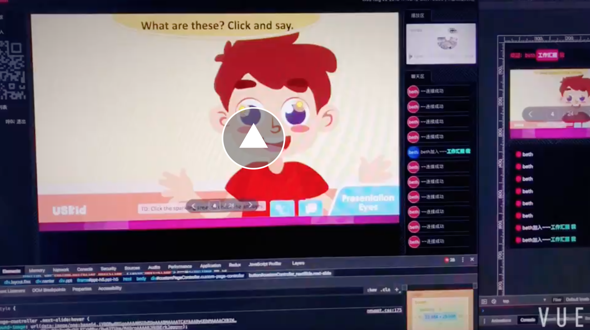

# LivePPT
> 再直播中调用的ppt如何实现事件同步

## PPT存在的问题
* 1.两端的页面加载不同步问题
* 2.标准的数据结构
* 3.不同端的权限不同
* 4.如果用户断开之后如何回到上一步上课状态
* 5.如何处理不同角色PPT的样式
* 6.PPT转H5本身的问题严重
* 7.事件监听
* 8.事件翻页
* 9.页面跳转
* 10.动画事件监听

## 截屏
[](./assets/video.mp4)

## Example

## 实例代码
`PPT端`

```js
var LivePPT = new LivePPT();
LivePPT.receiveEvent('http://127.0.0.1:8081', function(res) {
  console.log('ppt接收：', res)
  LivePPT.init(res);
});
```

`教师端`

```js
var LivePPT = new LivePPT(
  document.getElementById('ppt-h5'),
  'http://127.0.0.1:8081/newppt/newppt.html?isLoadPageController=true',
);

LivePPT.receiveEvent('http://127.0.0.1:8081', function(res) {
  ws.send(JSON.stringify({
    roleType: 2,
    data: Object.assign({}, {
      type: 'ppt',
      name: queryString.name,
    }, res),
  }));
});
```

`学生端`

```js
var LivePPT = new LivePPT(
  document.getElementById('ppt-h5'),
  'http://127.0.0.1:8081/newppt/newppt.html?isLoadPageController=true&hideCustomPage=true',
);
```
